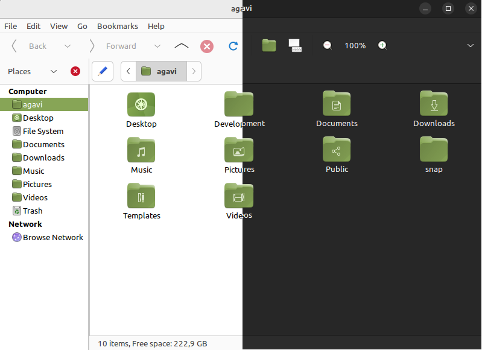

# yuru 

The default grey Yaru folders felt a little drab and I wanted to add some playfulness to my desktop, so I recolored them to the iconic `#87a556` with GIMP 😁️🧉️

It's named `Yuru-MATE` after [yaru](https://github.com/ubuntu/yaru) and [suru](https://github.com/snwh/suru-icon-theme), which sported vibrant, colorful, lively icons and was once the accompanying icon theme to an older version of the yaru gtk theme

Made with love on Ubuntu MATE 22.04

## preview - Yuru MATE (split screen)
The left side of the picture showcases the light variant
The right side of the picture showcases the light variant
There are separate screenshots for each variant in the assets folder

## usage 

* You can either `git clone` this repository, or download the zip file in the `Releases` tab

* Check to see if the `~/.local/share/icons` folder exists in your system - if it doesn't you can create it yourself by running `mkdir -p ~/.local/share/icons`

* place the `Yuru-MATE-light` and `Yuru-MATE-dark` variants in `~/.local/share/icons`

* open the "Appearance" program in Ubuntu MATE, select the theme you want, click `customize`, go to the `Icons` tab, and scroll down until you see `Yuru MATE light` and `Yuru MATE dark`, select those, and you're all set!

### important usage note

Note that you need to keep both variants around as `Yaru MATE Dark`, and consequently `Yuru-MATE-dark` inherit icons from the light variant! 

## license 

Since this is the Yaru MATE icon set with recolored folders, it ships under the same license as the [ubuntu-mate-artwork](https://github.com/ubuntu-mate/ubuntu-mate-artwork/blob/master/COPYING) assets

